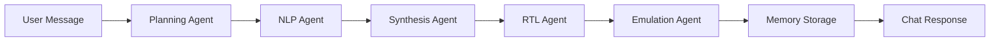

# SPARTA Chat - Multi-Agent Hardware Design Assistant

ChatGPT-style conversational interface for RTL/Verilog generation with self-correction and memory.

## Architecture

```
sparta-chat/
├── backend/
│   ├── main.py              # FastAPI orchestrator with /chat endpoint
│   ├── agents/              # Multi-agent system
│   │   ├── planning_agent.py     # Task breakdown & intent detection
│   │   ├── nlp_agent.py          # Natural language parsing
│   │   ├── synthesis_agent.py    # Architecture generation
│   │   ├── rtl_agent.py          # Verilog/SystemVerilog generation
│   │   └── emulation_agent.py    # Simulation & verification
│   ├── memory/
│   │   └── vector_memory.py      # Session memory + design library
│   ├── db/
│   │   └── database.py           # SQLite chat history
│   └── utils/
│       └── formatting.py         # Response formatting & visualization
├── frontend/
│   └── app.py              # Streamlit chat UI
└── requirements.txt
```

## Features

- ✅ **ChatGPT-Style UI**: Conversational interface with message history
- ✅ **Self-Correction**: Retry failed operations up to 3 times
- ✅ **Multi-Agent System**: Planning → NLP → Synthesis → RTL → Emulation
- ✅ **Memory**: Session context (RAM) + long-term design library (JSON)
- ✅ **Database**: SQLite chat history with aiosqlite
- ✅ **Visualizations**: Matplotlib waveform plots embedded in responses
- ✅ **Rich Formatting**: Emoji-rich conversational outputs

## Quick Start

### 1. Install Dependencies

```bash
cd sparta-chat
pip install -r requirements.txt
```

### 2. Start Backend (Port 9000)

```bash
cd backend
uvicorn main:app --host 0.0.0.0 --port 9000 --reload
```

### 3. Start Frontend (Port 8501)

```bash
cd frontend
streamlit run app.py
```

### 4. Open Browser

Navigate to: http://localhost:8501

## Usage Examples

### Example 1: Simple Adder
```
User: Generate a 4-bit adder
SPARTA: 🎯 Design Created...
```

### Example 2: Complex ALU
```
User: Create an 8-bit ALU with ADD, SUB, AND, OR operations
SPARTA: 📐 Generating architecture...
```

### Example 3: FSM
```
User: Design a traffic light state machine
SPARTA: 🔄 Creating FSM with RED, YELLOW, GREEN states...
```

## Agent Workflow



## Self-Correction Loop

Each agent can retry on failure:
- **Attempt 1**: Initial execution
- **Attempt 2**: Error analysis + refined prompt
- **Attempt 3**: Simplified fallback approach

## Memory System

- **Short-Term (RAM)**: Session context for current conversation
- **Long-Term (JSON)**: Design library searchable by component type

## Database Schema

```sql
CREATE TABLE chat_history (
    id INTEGER PRIMARY KEY AUTOINCREMENT,
    session_id TEXT NOT NULL,
    timestamp DATETIME DEFAULT CURRENT_TIMESTAMP,
    role TEXT NOT NULL,
    message TEXT NOT NULL,
    metadata TEXT
);
```

## API Endpoints

### POST /chat
```json
{
  "session_id": "uuid",
  "message": "Generate a 4-bit adder"
}
```

**Response:**
```json
{
  "response": "🎯 Design Created...",
  "visualization": "base64_image",
  "internal_notes": "Planning: design_creation...",
  "metadata": {
    "metrics": {"area_mm2": 0.05},
    "simulation_status": "passed"
  }
}
```

### GET /search
```
GET /search?query=adder&limit=5
```

## Integration with Original SPARTA

The chat system can call the original SPARTA microservices:
- NLP Agent Service (port 8010)
- Synthesis Agent Service (port 8011)
- RTL Generator Service (port 8021)
- Emulator Service (port 8020)

Ensure these services are running via Docker Compose:
```bash
cd ../
docker-compose up -d
```

## Configuration

Edit `backend/main.py` for:
- Agent service URLs (NLP_AGENT_URL, etc.)
- Memory file paths
- Database location
- Retry attempt limits

## Troubleshooting

### Backend won't start
- Check if port 9000 is available
- Verify dependencies: `pip install -r requirements.txt`

### Frontend connection error
- Ensure backend is running on port 9000
- Check BACKEND_URL in `frontend/app.py`

### Agents not responding
- Start original SPARTA services: `docker-compose up`
- Verify agent URLs in `backend/agents/*.py`

## Future Enhancements

- [ ] Docker containerization
- [ ] Real vector embeddings (currently keyword search)
- [ ] Multi-user support with authentication
- [ ] Export to GitHub/GitLab
- [ ] Advanced waveform visualization
- [ ] Code review and optimization suggestions

## License

MIT
